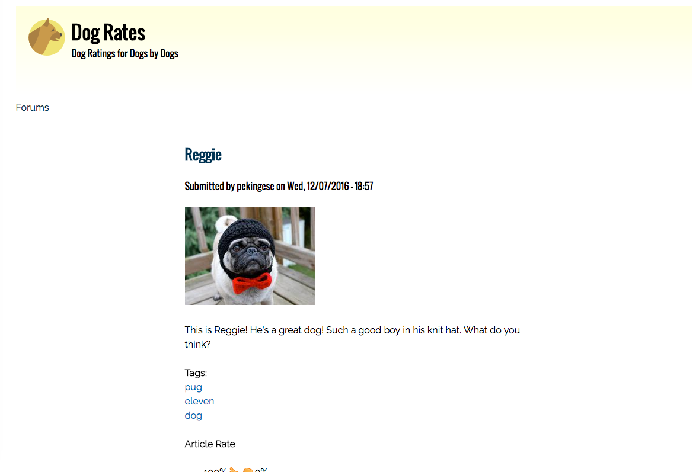

# Dogrates
A website for dogs to rate other dogs.

## Description
A Drupal Website for Dogs to Rate Dogs! This site was built to experiment with theming and sub-theming as well as figure out Drupal deployment methods. Currently hosted on Pantheon.io.

## Technologies

Drupal, PHP, SQL, and the Zen Subtheme.

## Usage

To use the code, you can clone the repository at [https://github.com/jryanconklin/dogrates](https://github.com/jryanconklin/dogrates).
To view the site, you can go to [http://live-dogrates.pantheonsite.io/](http://live-dogrates.pantheonsite.io/).

For best results, please:

- Clone the Repository
- Port the Provided "dogrates_database" Database to Your SQL Provider
- Launch Project in Server Mode via MAMP, LAMP or WAMP

* Note that you will need a password to use this project. If you'd like to experiment with this project, please contact me via GitHub for details.

## User Stories

* As a Dog, I want to rate other dogs to prove who is the best.

* As a Dog, I want to see forum posts to talk about who is the best dog.

## Current Bugs

* Navigation Broken on Subtheme. Layout is not ideal.

* Gradients in Header Not Working as Intended in Safari.

## Authors
J. Ryan Conklin

##License
This work can be used under the MIT License.
Copyright (c) 2016 J. Ryan Conklin
